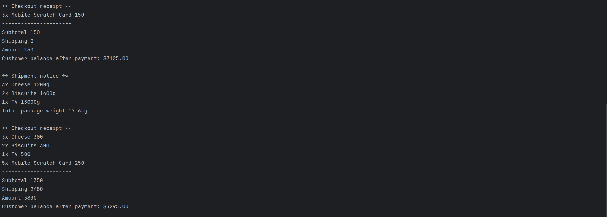

# E-commerce System

E-commerce System is a comprehensive Java console-based application that simulates an online shopping platform with inventory management, shopping cart functionality, and shipping services.

## Features

- **Product Management**: Add products with name, price, and quantity
- **Product Types**:
  - **ProductsExpire**: Products with expiry dates (Cheese, Biscuits) that can require shipping
  - **ProductsNotExpire**: Products without expiry (TV, Mobile, Scratch Cards) with optional shipping
- **Shopping Cart**: Add products with quantity validation and stock checking
- **Checkout System**: 
  - Validates cart contents, stock availability, and product expiry
  - Calculates subtotal, shipping fees, and total amount
  - Processes customer payments and updates inventory
- **Shipping Service**: 
  - Groups identical items in shipping manifest
  - Calculates weight-based shipping costs (50 pounds per kg)
  - Handles both shippable and non-shippable items
- **Error Handling**: Comprehensive validation for empty carts, insufficient balance, expired products, and stock issues

## Technologies Used

- Java (OpenJDK 17+)
- IntelliJ IDEA 
- OOP design (inheritance, polymorphism, interfaces)

## How to Run

1. Open the project in **IntelliJ IDEA** or **Eclipse**
2. Ensure SDK is set to Java 17 or higher
3. Navigate to `ECommerceDemo.java`
4. Right-click and choose **Run**
5. Console output will show various test scenarios including successful checkouts and error handling

## Screenshots

### App Running - Successful Checkout


### App Running - Error Handling


### App Running - Non-shippable Items and Large Orders


## Folder Structure

```
E-commerce-System/
├── src/
│   ├── Products.java
│   ├── ProductsNotExpire.java
│   ├── ProductsExpire.java
│   ├── Customer.java
│   ├── Cart.java
│   ├── CartItem.java
│   ├── ShippingItemsInterface.java
│   ├── ShipItems.java
│   ├── GroupItems.java
│   ├── ShippingService.java
│   ├── ECommerce.java
│   └── Main.java (testing class)
├── screenshots/
│   ├── checkout.png
│   ├── checkout2.png
│   └── error.png
└── README.md
```

## Sample Output

```
** Shipment notice **
2x Cheese 800g
1x TV 15000g
Total package weight 15.8kg

** Checkout receipt **
2x Cheese 200
1x TV 500
1x Mobile Scratch Card 50
----------------------
Subtotal 750
Shipping 790
Amount 1540
Customer balance after payment: $1090.00
```

## Notes

- The system uses polymorphism to handle different product types seamlessly
- Shipping service works with any object implementing the Shippable interface
- Easy to extend by adding new product types without modifying existing code
- All console output includes detailed checkout receipts and shipping manifests

---
